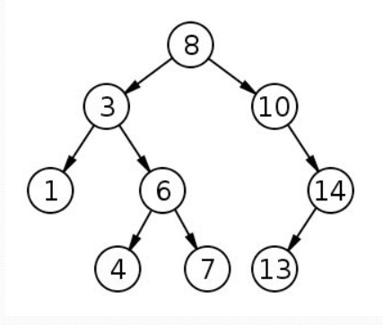
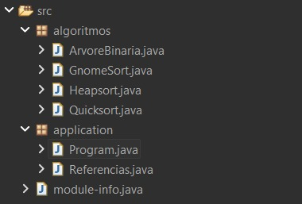
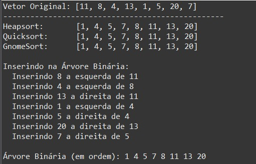
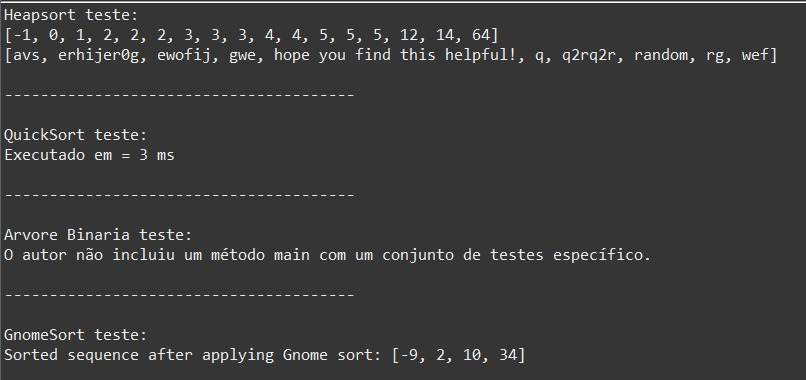

# Algoritmos de Ordenação - 06/10

### Heapsort

 Heapsort é um algoritmo de ordenação eficiente baseado no uso de estruturas de dados denominadas heaps (máxima/mínima). Um heap é uma estrutura de dados baseada em árvore que satisfaz a propriedade heap – ou seja, para um heap máximo, a chave de qualquer nó é menor ou igual à chave de seu pai (se tiver um pai).

Essa propriedade pode ser aproveitada para acessar o elemento máximo no heap em tempo O(logn) usando o método maxHeapify. Realizamos esta operação n vezes, cada vez movendo o elemento máximo no heap para o topo do heap e extraindo-o do heap para um array ordenado. Assim, após n iterações teremos uma versão ordenada do array de entrada.

O algoritmo exige que uma estrutura de dados heap seja construída primeiro. O algoritmo não é estável, o que significa que ao comparar objetos com a mesma chave, a ordenação original não será preservada.

Este algoritmo é executado em tempo O(nlogn) e requer espaço adicional O(1) [O(n) incluindo o espaço necessário para armazenar os dados de entrada], uma vez que todas as operações são executadas inteiramente in loco.

A complexidade de tempo melhor, pior e média do Heapsort é O(nlogn). Embora heapsort tenha uma complexidade de pior caso melhor do que o quicksort, quando bem implementado, o quicksort é executado mais rapidamente na prática. Heapsort é um algoritmo baseado em comparação, portanto, pode ser usado para conjuntos de dados não numéricos, na medida em que alguma relação (propriedade de heap) possa ser definida sobre os elementos. [1]

Uma implementação em Java é apresentada abaixo :

    import java.util.Arrays;

    public class Heapsort {

	public static void main(String[] args) {
		//array de teste
		Integer[] arr = {1, 4, 3, 2, 64, 3, 2, 4, 5, 5, 2, 12, 14, 5, 3, 0, -1};
		String[] strarr = {"hope you find this helpful!", "wef", "rg", "q2rq2r", "avs", "erhijer0g", "ewofij", "gwe", "q", "random"};
		
		arr = heapsort(arr);
		strarr = heapsort(strarr);
		
		System.out.println(Arrays.toString(arr));
		System.out.println(Arrays.toString(strarr));
	}
	
	//O(nlogn) TEMPO, O(1) ESPAÇO, NÃO ESTÁVEL
	public static <E extends Comparable<E>> E[] heapsort(E[] arr){
		int heaplength = arr.length;
		for(int i = arr.length/2; i>0;i--){
			arr = maxheapify(arr, i, heaplength);
		}
		
		for(int i=arr.length-1;i>=0;i--){
			E max = arr[0];
			arr[0] = arr[i];
			arr[i] = max;
			heaplength--;
			arr = maxheapify(arr, 1, heaplength);
		}
		
		return arr;
	}
	
	//Cria maxheap a partir de um array
	public static <E extends Comparable<E>> E[] maxheapify(E[] arr, Integer node, Integer heaplength){
		Integer left = node*2;
		Integer right = node*2+1;
		Integer largest = node;
		
		if(left.compareTo(heaplength) <=0 && arr[left-1].compareTo(arr[node-1]) >= 0){
			largest = left;
		}
		if(right.compareTo(heaplength) <= 0 && arr[right-1].compareTo(arr[largest-1]) >= 0){
			largest = right;
		}	
		if(largest != node){
			E temp = arr[node-1];
			arr[node-1] = arr[largest-1];
			arr[largest-1] = temp;
			maxheapify(arr, largest, heaplength);
		}
		return arr;
	}
	}
	
---

### QuickSort

Este algoritmo usa uma técnica conhecida por divisão e conquista, muito conhecida por reduzir problemas complexos em problemas menores para tentar chegar em uma solução. Sendo assim, o resultado do problema inicial é dada como a soma do resultado de todos os problemas menores. Sua complexidade é:

	
* **Complexidade Pior Caso:** `O(n²)`
* **Complexidade Caso Médio:** `O(n log n)`
* **Complexidade Melhor Caso:** `O(n log n)`

	O QuickSort sai na frente de outros algoritmos mais simples quando tratamos do caso médio, por trabalhar com logaritmo (nlogn), o que torna o resultado mais rápido do que o InsertionSort e o QuickSort.

O algoritmo consiste nos seguintes passos:

	
1. Escolhe-se um elemento qualquer da lista, que será chamado de pivô.
2. Todos os elementos antes do pivô devem ser menores que ele e todos os elementos após o pivô devem ser maiores que ele. Quando esse processo de separação for finalizado, então o pivô deve estar exatamente no meio da lista.
3. De forma recursiva os elementos da sublista menor e maiores são ordenados.

		public static void main(String[] args) throws IOException {

             int quantidade = 10000;
             int[] vetor = new int[quantidade];

             for (int i = 0; i < vetor.length; i++) {
                     vetor[i] = (int) (Math.random()*quantidade);
             }

             long tempoInicial = System.currentTimeMillis();

             quickSort(vetor,0,vetor.length-1);

             long tempoFinal = System.currentTimeMillis();

             System.out.println("Executado em = " + (tempoFinal - tempoInicial) + " ms");

       }

       private static void quickSort(int[] vetor, int inicio, int fim) {
             if (inicio < fim) {
                    int posicaoPivo = separar(vetor, inicio, fim);
                    quickSort(vetor, inicio, posicaoPivo - 1);
                    quickSort(vetor, posicaoPivo + 1, fim);
             }
       }

       private static int separar(int[] vetor, int inicio, int fim) {
             int pivo = vetor[inicio];
             int i = inicio + 1, f = fim;
             while (i <= f) {
                    if (vetor[i] <= pivo)
                           i++;
                    else if (pivo < vetor[f])
                           f--;
                    else {
                           int troca = vetor[i];
                           vetor[i] = vetor[f];
                           vetor[f] = troca;
                           i++;
                           f--;
                    }
             }
             vetor[inicio] = vetor[f];
             vetor[f] = pivo;
             return f;
       }

O primeiro passo é separar as listas, como havíamos citado anteriormente. No método `separar()` esse processo é realizado até que seja retornado um pivô, ou seja, o elemento divisível entre as duas listas.

Finalizado o processo de separação então é chamado um próprio método `quickSort()` de forma recursiva, onde ele fará o processo de separação interna dentro da sublista e assim será feito até que todos os elementos estejam ordenados.

O QuickSort é um algoritmo mais robusto e complexo que os mostrados anteriormente, por isso achamos importante exemplificar o seu uso através do pseudocódigo.

Vejamos na tabela abaixo a comparação entre o tempo de execução.

### QuickSort - Tempo de Execução

| Elementos | Tempo Médio (`n log n`) |
|-----------|-------------------------|
| 100       | 0 ms                    |
| 1.000     | 0 ms                    |
| 10.000    | 39 ms                   |
| 100.000   | 43 ms                   |
| 200.000   | 50 ms                   |

Veja que o tempo de processamento do QuickSort é muito bom quando tratamos do caso médio, que é exatamente o nosso caso (randômico). Veja que o tempo para 200.000 registros é muito eficiente, muito mais que os mostrados anteriormente para este tipo de caso. [2]

---

### Árvores Binárias

As árvores são estruturas de dados baseadas em listas encadeadas que possuem um nó superior também chamado de raiz que aponta para outros nós, chamados de nós filhos, que podem ser pais de outros nós.
Uma árvore de busca binária tem as seguintes propriedades:

* todos os elementos na subárvore esquerda de um determinado nó n são menores que n;
* todos os elementos na subárvore direita de um determinado nó n são maiores ou iguais a n.

Segue na Figura 1 uma ilustração de um exemplo de árvore binária.

No exemplo acima tem-se uma árvore binária onde a raiz é o elemento 8, o filho da esquerda do elemento 8 é o elemento 3, o filho da direita é o elemento número 10. Nota-se que todos elementos da árvore binária possuem no máximo dois filhos, sendo o da esquerda sempre menor e o da direita sempre maior que o elemento pai. [3]

---

### Gnome Sort 

(Peguei em um site gringo o algoritmo, por isso está em inglês)

**Algorithm Steps**

1. If you are at the start of the array then go to the right element (from arr[0] to arr[1]).
2. If the current array element is larger or equal to the previous array element then go one step right
        
        if (arr[i] >= arr[i-1])
        i++;
   
1. If the current array element is smaller than the previous array element then swap these two elements and go one step backwards
   
		if (arr[i] < arr[i - 1]) {
			swap(arr[i], arr[i - 1]);
			i--;
		}

1. Repeat steps 2) and 3) till ‘i’ reaches the end of the array (i.e- ‘n-1’)
2. If the end of the array is reached then stop and the array is sorted.

   		// Java Program to implement Gnome Sort 

		import java.util.Arrays;

		public class GFG {
		static void gnomeSort(int arr[], int n) {
		int index = 0;

		while (index < n) {
			if (index == 0)
				index++;
			if (arr[index] >= arr[index - 1])
				index++;
			else {
				int temp = 0;
				temp = arr[index];
				arr[index] = arr[index - 1];
				arr[index - 1] = temp;
				index--;
			}
		}
		return;
		}

		// Driver program to test above functions.
		public static void main(String[] args) {
		int arr[] = { 34, 2, 10, -9 };

		gnomeSort(arr, arr.length);

		System.out.print("Sorted sequence after applying Gnome sort: ");
		System.out.println(Arrays.toString(arr));
		}
		}

		// Code Contributed by Mohit Gupta_OMG

**Output:**

		Sorted sequence after applying Gnome sort: [-9, 2, 10, 34]

**Time Complexity**: O(n2). As there is no nested loop (only one while) it may seem that this is a linear O(n) time algorithm. But the time complexity is O(n^2) as the variable ‘index’ in the program doesn’t always get incremented, it gets decremented too. 
**Auxiliary Space**: O(n) [4]

---

### Implementação

* Separei os algoritmos em classes.
* Em `application`, na classe `Program.java`, contém o teste de todos os algoritmos padronizados.
* Já em `Referencias.java`, têm os testes realizados pelos autores dos algoritmos, testes presentes nos artigos.

**Console**

* Program.java:
   

* Referencias.java

### Referências

&nbsp; &nbsp; [1] Mbah R. Algoritmos de Ordenação Explicados – com Exemplos em Python, Java e C++. [publicação online]; 2020. [acesso em 05 out 2025]. Disponível em: <a href="https://www.freecodecamp.org/portuguese/news/algoritmos-de-ordenacao-explicados-com-exemplos-em-python-java-e-c/">https://www.freecodecamp.org/portuguese/news/algoritmos-de-ordenacao-explicados-com-exemplos-em-python-java-e-c/</a>

&nbsp; &nbsp; [2] DevMedia. Algoritmos de Ordenação em Java. [publicação online]; [acesso em 05 out 2025]. Disponível em: <a href="https://www.devmedia.com.br/algoritmos-de-ordenacao-em-java/32693">https://www.devmedia.com.br/algoritmos-de-ordenacao-em-java/32693</a>

&nbsp; &nbsp; [3] DevMedia. Trabalhando com árvores binárias em Java. [publicação online]; [acesso em 05 out 2025]. Disponível em: <a href="https://www.devmedia.com.br/trabalhando-com-arvores-binarias-em-java/25749">https://www.devmedia.com.br/trabalhando-com-arvores-binarias-em-java/25749</a>

&nbsp; &nbsp; [4] GeeksforGeeks. Java Program for Gnome Sort. [publicação online]; 2025. [acesso em 05 out 2025]. Disponível em: <a href="https://www.geeksforgeeks.org/dsa/java-program-for-gnome-sort/">https://www.geeksforgeeks.org/dsa/java-program-for-gnome-sort/</a>

